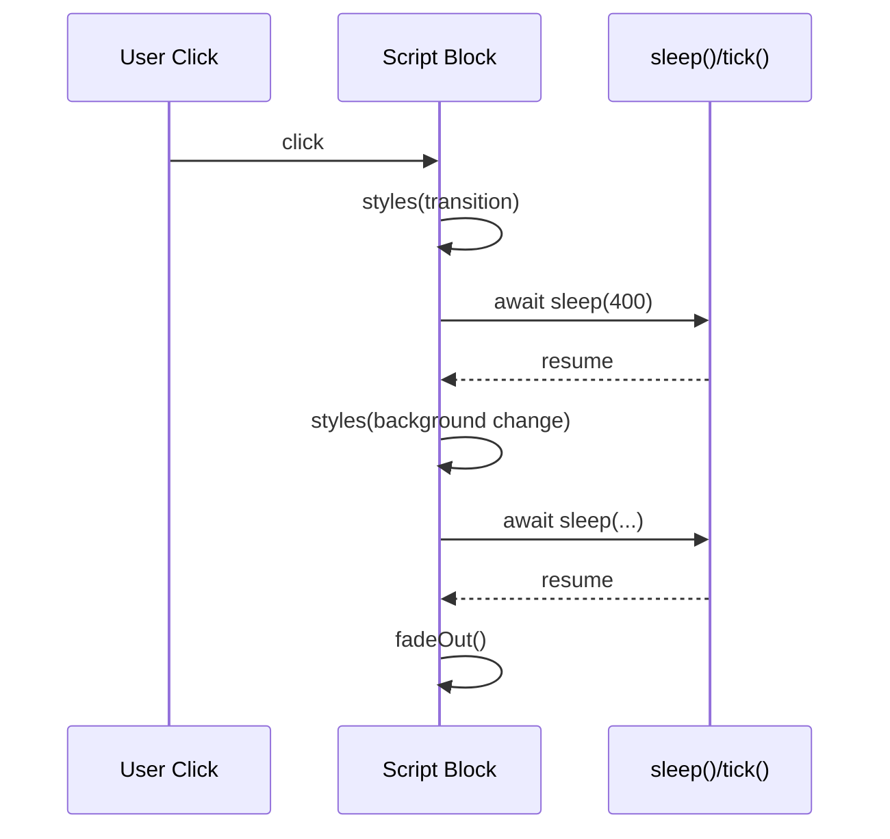

# Surreal

Tiny ~320 line ergonomic DOM helper: a jQuery‑style chainable layer for plain JavaScript focused on Locality of Behavior (LoB) – author behavior inline next to markup via `me()` and `any()` without needing IDs or global selectors.

## Rendering & Behavior Lifecycle

Surreal encourages colocating the "what" (markup) and the "how" (behavior) inside the same structural block.

Typical flow:

1. Server (or static files) send simple semantic HTML.
2. Surreal script blocks enhance elements in place using `me()` (single) or `any()` (plural).
3. Optional async timelines animate or progressively modify.
4. Events dispatch (`send`) and chainable mutations apply (`classAdd`, `styles`, `fadeOut`).

```mermaid
flowchart TD
  H[HTML Element] --> S[Inline <script>]
  S --> SEL[me() / any()]
  SEL --> CH[Chain sugar methods]
  CH --> MUT[DOM Mutations]
  CH --> EVT[Event Binding]
  MUT --> UX[User Experience]
  EVT --> UX
```

Locality reduces naming overhead: the script can address its parent without a class or ID.

### Locality Example

```html
<button>
  Delete
  <script>
    (() => {
      me().on("click", (ev) => {
        me(ev).disable().fadeOut();
      });
    })();
  </script>
</button>
```

No IDs. No global query. Direct parent reference.

## Installation

Download (zero build step):

```html
<script src="/surreal.js"></script>
```

Or via CDN:

```html
<script src="https://cdn.jsdelivr.net/gh/gnat/surreal@main/surreal.js"></script>
```

Surreal auto‑registers convenience globals (`me`, `any`, etc.). You can remove global sugar if desired (edit `surreal.js` and skip `globalsAdd()`). Plugin methods are not added as separate globals; they attach per element after sugar runs.

## Core Concepts

### Selectors: Single vs Many

| Need                    | Surreal           | Returns             | Notes                               |
| ----------------------- | ----------------- | ------------------- | ----------------------------------- |
| Parent of inline script | `me()`            | HTMLElement         | Inline parent                       |
| First matching element  | `me('.btn')`      | HTMLElement or null | Graceful null                       |
| All matching elements   | `any('.btn')`     | Array<HTMLElement>  | Always array                        |
| Previous sibling (void) | `me('-')`         | HTMLElement         | Also `me('prev')`, `me('previous')` |
| Convert list to single  | `me(any('.row'))` | HTMLElement         | First of list                       |

Design rule: You always know cardinality; fewer defensive checks.

### Chaining Sugar

Surreal decorates returned elements (and arrays) with helper methods:

- `classAdd`, `classRemove`, `classToggle`
- `styles`
- `attribute`
- `on`, `off`, `offAll`
- `send` / `trigger`
- `disable`, `enable`
- Plugins (e.g. `fadeOut`, `fadeIn`)

```html
<div class="notice">
  This will self‑dismiss.
  <script>
    (() => {
      me().on("click", (ev) => {
        me(ev).classAdd(".clicked").fadeOut();
      });
    })();
  </script>
</div>
```

Optional style: Use functional form (no sugar):

```js
(() => {
  (() => {
    on(me(".btn"), "click", (ev) => {
      classAdd(me(ev), ".active");
      fadeOut(me(ev));
    });
  })();
})();
```

### Attribute & Style APIs

```js
// Styles
me().styles("color: red");
me().styles({ background: "#222", color: "#fff" });
me().styles({ background: null }); // remove style

// Attributes
me().attribute("data-state", "ready");
me().attribute({ "data-x": "1", "data-y": "2" });
me().attribute("data-x", null); // remove
```

Leading dot optional for classes:
`classAdd('active')` == `classAdd('.active')`

### Events

```js
me().on("click", (ev) => {
  halt(ev);
  me(ev).classToggle(".open");
});
me().send("custom", { payload: 42 });
me().disable();
me().enable();
offAll(me(".expensive")); // strip all listeners by cloning
```

`halt(ev)` = `preventDefault` + `stopPropagation` unless overridden.

### Async Timelines

Sequential animation without external libraries:

```html
<div class="flash">
  Animate
  <script>
    (() => {
      me().on("click", async (ev) => {
        let el = me(ev); // persist across awaits
        el.styles({ transition: "background 0.4s" });
        await sleep(400);
        el.styles({ background: "#ff3860" });
        await sleep(400);
        el.styles({ background: "#ffdd57" });
        await sleep(400);
        el.fadeOut();
      });
    })();
  </script>
</div>
```

Helpers:

- `sleep(ms)` – Promise delay.
- `tick()` – next animation frame flush (layout + paint).

## Effects (Built-in Plugin)

`fadeOut(cb?, ms=1000, remove=true)`:

```html
<button>
  Bye
  <script>
    (() => {
      me().on("click", (ev) => me(ev).fadeOut());
    })();
  </script>
</button>
```

`fadeIn(cb?, ms=1000)`:

```html
<div class="invisible">
  Reveal
  <script>
    (() => {
      me().on("click", (ev) => me(ev).fadeIn());
    })();
  </script>
</div>
```

## Interop with HTMX / Server Rendering

Surreal pairs well with server‑rendered HTML (Go `templ`, HTMX swaps). After HTMX updates a fragment:

```html
<div id="panel" hx-get="/fragment" hx-trigger="load">
  <script>
    (() => {
      onloadAdd(() =>
        any("#panel button").on("click", (ev) => me(ev).classToggle(".active")),
      );
    })();
  </script>
</div>
```

Locality keeps bindings near DOM rather than central controllers.

## Suspense-like Progressive Enhancement

Instead of complex hydration:

1. Server renders placeholder.
2. Inline script progressively replaces once data arrives via `fetch()` or htmx.

```html
<div class="user" data-id="42">
  Loading...
  <script>
    (async (el = me()) => {
      let id = el.attribute("data-id");
      let res = await fetch(`/api/user/${id}`);
      if (res.ok) {
        el.textContent = (await res.json()).name;
      }
    })();
  </script>
</div>
```

## Patterns

### Parent Scoping

```html
<div class="widget">
  <button>Toggle</button>
  <div class="panel hidden">Content</div>
  <script>
    (() => {
      me("button", me()).on("click", (ev) => {
        me(".panel", me()).classToggle(".hidden");
      });
    })();
  </script>
</div>
```

### Previous Sibling (void element)

```html
<input type="text" />
<script>
  (() => {
    me("-").value = "preset";
  })();
</script>
```

### Bulk Data Attributes

```html
<ul>
  <li>A</li>
  <li>B</li>
  <li>C</li>
  <script>
    (() => {
      any("li", me()).run((li) => {
        li.attribute(
          "data-index",
          Array.from(li.parentNode.children).indexOf(li),
        );
      });
    })();
  </script>
</ul>
```

### Event Relay with halt()

```html
<div class="modal">
  <div class="dialog">
    <button class="close">Close</button>
    <script>
      (() => {
        me(".close", me()).on("click", (ev) => {
          halt(ev); // stop bubbling out
          me(".modal").fadeOut();
        });
        me(".modal").on("click", (ev) => me(ev).fadeOut());
      })();
    </script>
  </div>
</div>
```

## Plugin Authoring

Add chain methods safely:

```js
function pluginHello(el) {
  el.hello = (name = "World") => {
    console.log("Hello " + name);
    return el; // preserve chain
  };
}
surreal.plugins.push(pluginHello);
```

Usage:

```html
<div>
  <script>
    (() => {
      me().hello("LLM");
    })();
  </script>
</div>
```

Guidelines:

- Handle NodeList: attach per element.
- Return element for chaining.
- Avoid name collisions (check `el.hello`).
- Plugin methods are not global; they appear only on elements after sugar (`me()` / `any()`).

## Safety & Pitfalls

| Concern                                | Guidance                                           |
| -------------------------------------- | -------------------------------------------------- |
| Async losing `currentTarget`           | Capture `let el = me(ev)` before `await`.          |
| `fadeOut()` / `fadeIn()` chain end     | They return `undefined`; chaining stops afterward. |
| `fadeOut()` removes element            | Pass `remove=false` to keep it.                    |
| attribute() on NodeList                | Returns `[]`; iterate with `run`.                  |
| Chaining after `remove()`              | Ends chain; store reference earlier if needed.     |
| Excessive `offAll()`                   | Clones node; avoid on large trees.                 |
| Global collisions (if disabling sugar) | Use `surreal.me(...)` explicitly.                  |

Optional chaining helps with uncertain selectors:

```js
me("#maybe")?.classAdd(".found");
```

## Vanilla First (Prefer Native When Easy)

Use Surreal for ergonomic selection/chaining; keep direct APIs for simple tasks:

```js
me().textContent = "Safe text";
me().innerHTML = "<strong>Rich</strong>";
me().appendChild(createElement("div"));
```

## Performance

- Selection cost = native querySelector / querySelectorAll.
- Sugar adds lightweight method assignments.
- No diffing / virtual DOM.
- Avoid repeating `any('.x')` inside tight loops; cache results.
- `offAll` clones node (O(n) on subtree).

## Progressive Enhancement Checklist

1. Core content rendered without JS.
2. Inline script augments, does not replace critical data.
3. Failures degrade gracefully (no fatal global boot).

## Mermaid: Async Timeline Example



## Disabling Globals

If you edit out `globalsAdd()`:

```js
surreal.me(".btn").on("click", (ev) => surreal.me(ev).classToggle(".active"));
```

## Generating Good Examples (LLM Prompts)

- "Animate button through red → yellow → green then remove."
- "Add plugin method `stamp()` that sets a timestamp attribute."
- "Toggle sibling panel visibility using parent-scoped selector."
- "Batch-apply indexed data attributes to list items with Surreal."

## Minimal Starter

```html
<!DOCTYPE html>
<html>
  <head>
    <script src="surreal.js"></script>
    <style>
      .active {
        background: gold;
      }
    </style>
  </head>
  <body>
    <button>
      Toggle
      <script>
        (() => {
          me().on("click", (ev) => me(ev).classToggle(".active"));
        })();
      </script>
    </button>
  </body>
</html>
```

## Summary

Surreal provides:

- Cardinality‑aware selection (`me` single / `any` many).
- Chainable ergonomic DOM mutations & events.
- Inline behavioral locality (minimizes global naming).
- Tiny footprint + plugin extensibility (fadeIn/fadeOut included).
- Async timeline helpers (`sleep`, `tick`) for expressive animations.

Ideal for small interactive enhancements to server‑rendered or static HTML without adopting heavy frameworks. Combine with HTMX or templ; keep logic local, readable, and minimal.

Happy hacking. 🗿
